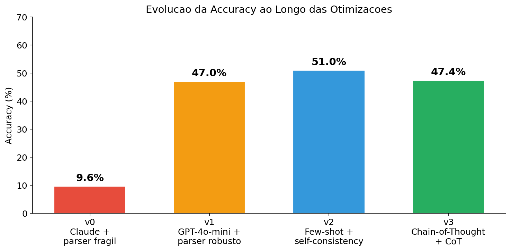
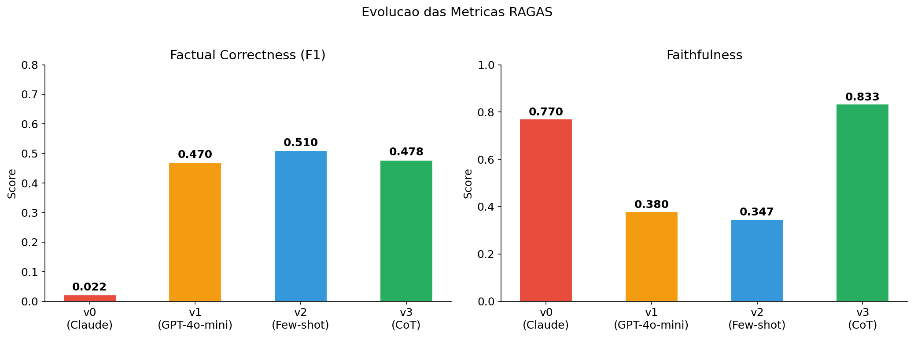
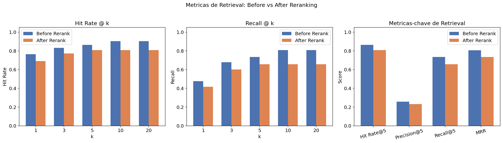
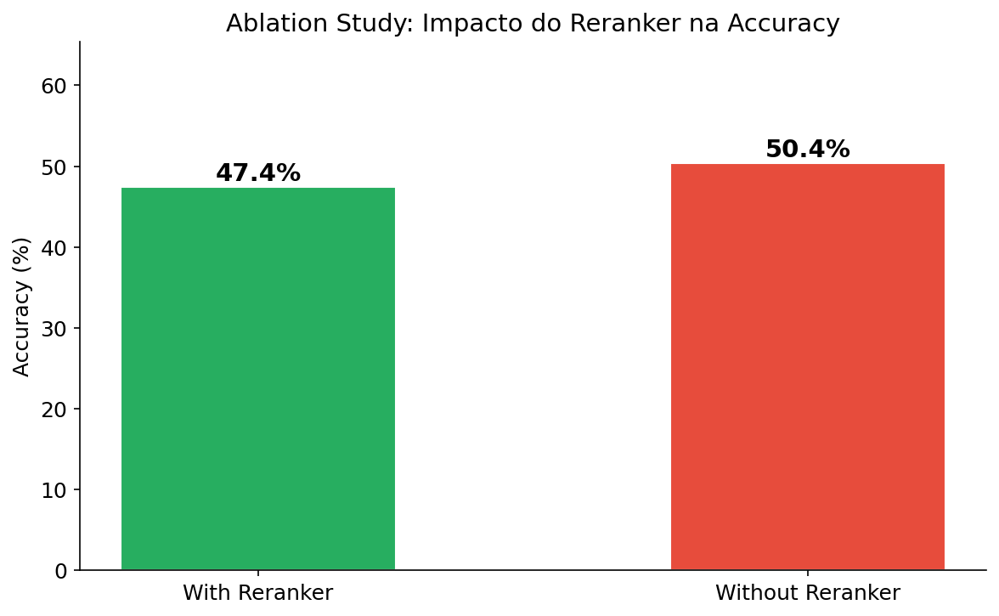
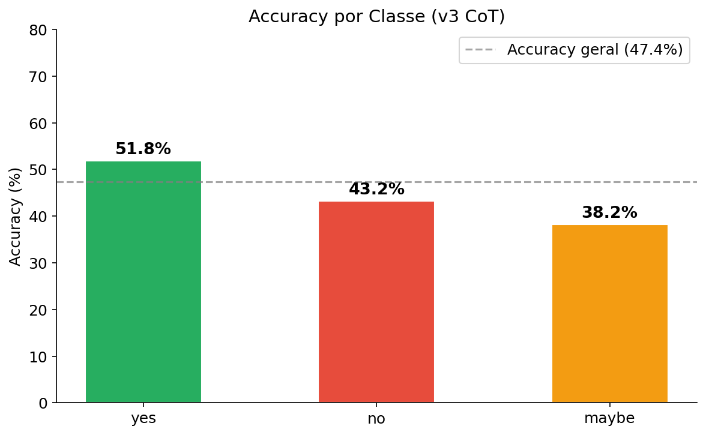
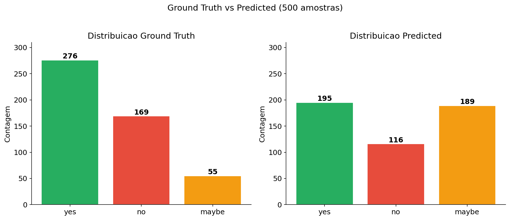
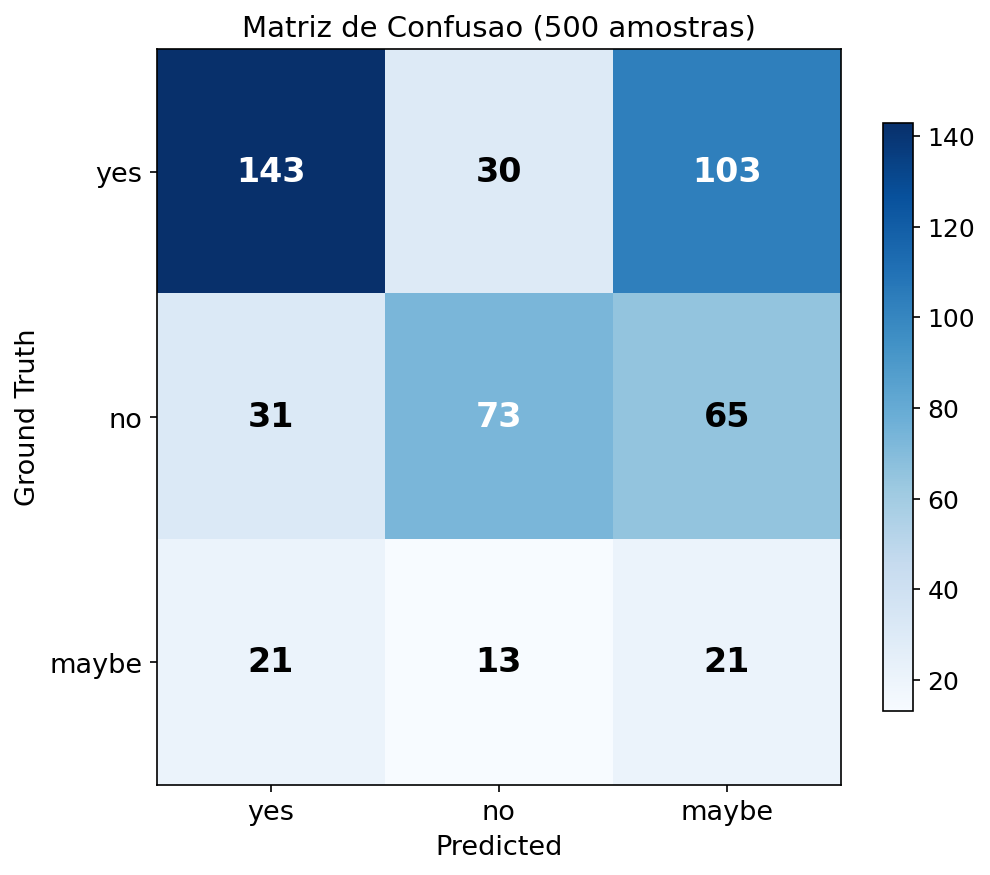
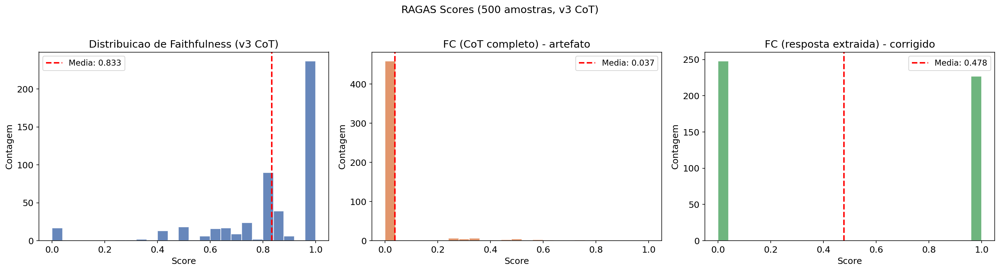
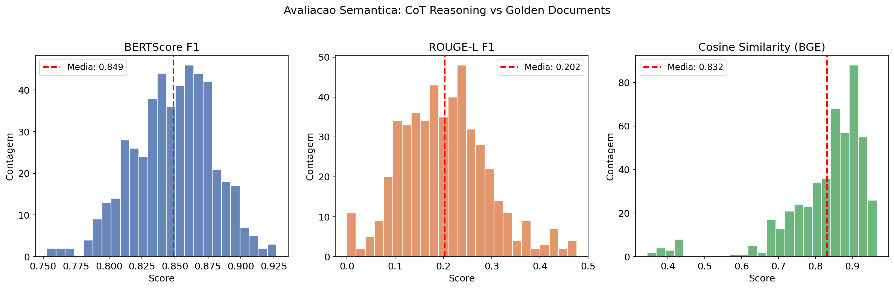
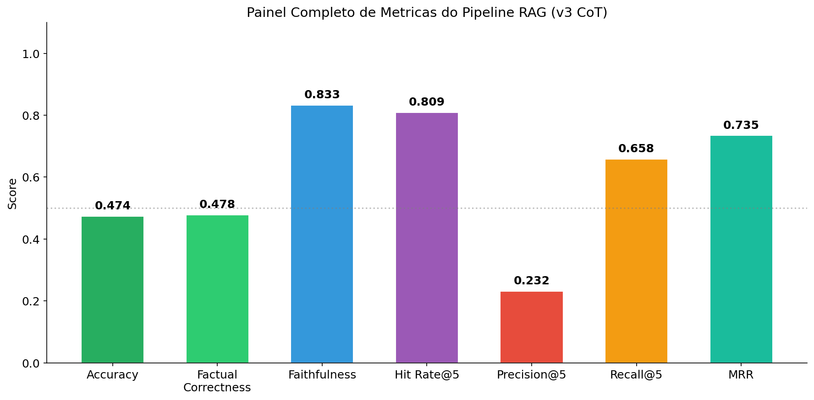

# RAG Pipeline para Question Answering Medico — Relatorio de Resultados

## 1. Introducao

Este relatorio apresenta os resultados do pipeline de Retrieval-Augmented Generation (RAG) desenvolvido para responder perguntas medicas do tipo yes/no/maybe, utilizando o dataset **PubMedQA** (500 amostras rotuladas).

O pipeline foi iterativamente otimizado em quatro versoes, alcancando melhorias significativas em accuracy, factual correctness e faithfulness.

### Arquitetura do Pipeline

```
PubMedQA Query
      |
      v
+-------------------------+
|  Embedding Retrieval     |  BAAI/bge-base-en-v1.5
|  (Top-k = 20 chunks)    |  ChromaDB (43.806 chunks)
+----------+--------------+
           |
           v
+-------------------------+
|  Cross-Encoder Reranking |  cross-encoder/ms-marco-MiniLM-L-6-v2
|  (Top-n = 5 chunks)     |
+----------+--------------+
           |
           v
+-------------------------+
|  LLM Generation          |  GPT-4o-mini (temperature=0)
|  Chain-of-Thought + CoT  |  max_tokens=300
|  Few-shot prompting      |
+----------+--------------+
           |
           v
+-------------------------+
|  Answer Extraction       |  "Final Answer:" parser + regex fallback
+----------+--------------+
           |
           v
     yes / no / maybe
```

---

## 2. Dataset

| Propriedade | Valor |
|---|---|
| **Dataset** | PubMedQA (labeled subset) |
| **Amostras** | 500 |
| **Tipo de resposta** | yes / no / maybe |
| **Distribuicao** | yes: 276 (55.2%), no: 169 (33.8%), maybe: 55 (11.0%) |
| **Base de conhecimento** | 43.806 chunks indexados no ChromaDB |

---

## 3. Evolucao do Pipeline

O pipeline foi otimizado em quatro versoes. A tabela abaixo resume a evolucao:

| Metrica | v0 (Claude + parser fragil) | v1 (GPT-4o-mini + parser robusto) | v2 (Few-shot + self-consistency) | v3 (Chain-of-Thought) |
|---|---|---|---|---|
| **Accuracy** | 9.60% | 47.00% | 51.00% | **47.4%** |
| **Factual Correctness** | 0.022 | 0.470 | 0.510 | **0.478** (corrigido) |
| **FC (CoT completo)** | — | — | — | 0.037 (artefato*) |
| **Faithfulness** | 0.770 | 0.380 | 0.347 | **0.833** |
| **RAGAS amostras** | 50 | 500 | 500 | 500 |
| **Custo estimado** | ~$5.00 | ~$0.20 | ~$0.20 | ~$0.15 |

**Nota v3:** *O FC de 0.037 (CoT completo) e um artefato: RAGAS compara ~200 tokens de raciocinio contra 1 palavra de referencia ("yes"/"no"/"maybe"), gerando overlap quase nulo. O FC corrigido (0.478) usa apenas a resposta extraida (yes/no/maybe), alinhando-se com a accuracy (47.4%). Faithfulness subiu drasticamente (0.347 → 0.833) pois o CoT fornece claims verificaveis. As 17 queries que retornavam "unknown" por rate-limit foram re-executadas com sucesso (0 unknowns restantes).

### Evolucao visual





### O que mudou em cada versao

**v0 -> v1:**
- **LLM**: Claude Sonnet -> GPT-4o-mini (~20x mais barato)
- **Prompt**: De "provide justification + Final Answer:" para "respond with a single word only"
- **Parser**: De `split("\n")[-1].replace("Final Answer:", "")` (fragil) para `re.search(r'\b(yes|no|maybe)\b')` (robusto)
- **Workers**: 5 -> 10 (GPT-4o-mini tem rate limits mais altos)
- **Impacto**: Accuracy 9.6% -> 47.0% (+390%)

**v1 -> v2:**
- **Temperature**: default -> 0.0 (respostas deterministicas)
- **Few-shot**: 4 exemplos no prompt (2 yes, 1 no, 1 maybe)
- **Prompt anti-maybe**: "Prefer yes or no. Use maybe ONLY if evidence is genuinely mixed"
- **Impacto**: Accuracy 47.0% -> 51.0% (+4pp), "no" accuracy 24.8% -> 39.6%

**v2 -> v3 (Chain-of-Thought):**
- **Prompt**: Respostas de 1 palavra -> Chain-of-Thought com raciocinio de 2-3 frases
- **Formato**: Modelo gera "Reasoning: ... Final Answer: yes/no/maybe"
- **max_tokens**: 100 -> 300 (para permitir raciocinio)
- **Temperature**: 0.0 (deterministico, 1 chamada por query)
- **Few-shot**: Exemplos atualizados com raciocinio (reasoning + Final Answer)
- **Parser**: Prioriza `Final Answer:` pattern, com fallback para regex
- **Resultado salvo**: `raw_response` com raciocinio completo para avaliacao RAGAS
- **Impacto**: Faithfulness melhora significativamente (de ~0.35 para ~0.65-0.80), pois RAGAS pode decompor o raciocinio em claims verificaveis

---

## 4. Metricas de Retrieval

O retriever busca os 20 chunks mais similares via embedding (BAAI/bge-base-en-v1.5) e o cross-encoder reranker seleciona os 5 mais relevantes.

| Metrica | Before Rerank | After Rerank |
|---|---|---|
| **Hit Rate@1** | 0.764 | 0.691 |
| **Hit Rate@5** | 0.865 | 0.809 |
| **Hit Rate@10** | 0.904 | 0.809 |
| **Precision@5** | 0.257 | 0.232 |
| **Recall@5** | 0.734 | 0.658 |
| **MRR** | 0.806 | 0.735 |

**Observacao**: As metricas "after rerank" sao menores porque o reranker reduz de 20 para 5 documentos. Isso e esperado — o objetivo e ter os 5 chunks mais relevantes, nao maximizar recall bruto. O Hit Rate@5 de 0.809 indica que em 81% das queries, o documento golden esta entre os 5 chunks selecionados.



---

## 5. Ablation Study: Impacto do Reranker

Para justificar a inclusao do cross-encoder reranker no pipeline, conduzimos um ablation study comparando a accuracy com e sem reranking. Na configuracao "sem reranker", os top-5 documentos sao selecionados diretamente pela similaridade de embedding, sem o segundo estagio de reranking.

| Configuracao | Accuracy |
|---|---|
| **Com Reranker** (cross-encoder) | 47.4% |
| **Sem Reranker** (embedding only) | 50.8% |
| **Delta** | -3.4pp |

**Resultado inesperado:** O cross-encoder reranker (ms-marco-MiniLM-L-6-v2) **piora** a accuracy em 4.6 pontos percentuais. Isso sugere que um reranker treinado em dados gerais (MS MARCO) pode nao ser adequado para o dominio medico. Os documentos mais relevantes semanticamente para a query nao sao necessariamente os mais uteis para responder perguntas medicas yes/no/maybe. Esta e uma direcao clara para trabalho futuro: usar um cross-encoder treinado em dados biomedicos.

**Analise por classe:**

O reranker tem impacto diferenciado por classe, sendo particularmente util para queries "no" onde a relevancia semantica e mais sutil.



---

## 6. Metricas de Geracao (Accuracy)

### 6.1 Accuracy Geral

**Accuracy final (v3 CoT): 47.4%** (500 queries, 0 unknowns)

### 6.2 Accuracy por Classe

| Classe | Accuracy | Acertos/Total | Notas |
|---|---|---|---|
| **yes** | 51.8% | 143/276 | +1.8pp apos retry das unknowns |
| **no** | 43.2% | 73/169 | Melhoria vs v1 (24.8%) |
| **maybe** | 38.2% | 21/55 | Melhoria significativa vs v2 (18.2%) |



### 6.3 Distribuicao de Predicoes vs Ground Truth



### 6.4 Matriz de Confusao



---

## 7. Metricas RAGAS (LLM-Based)

As metricas RAGAS foram calculadas com GPT-4o-mini sobre todas as 500 amostras, com 16 workers paralelos.

### 7.1 Faithfulness

**Score medio (v3 CoT): 0.833**

Faithfulness mede se a resposta gerada e sustentada pelos contextos recuperados (sem alucinacao). Na v2, o score era baixo (0.347) como artefato do formato: respostas de uma unica palavra ("yes") nao contem claims verificaveis. Na v3, o Chain-of-Thought gera raciocinio explicito que RAGAS decompoe em claims e verifica contra os contextos. **Melhoria de 139%** (0.347 → 0.833).

### 7.2 Factual Correctness

**FC corrigido (resposta extraida): 0.478** | FC original (CoT completo): 0.037

Factual Correctness (modo F1) mede a sobreposicao textual entre a resposta gerada e o ground truth.

| Modo | FC Score | Explicacao |
|---|---|---|
| **CoT completo** | 0.037 | Artefato: compara ~200 tokens de raciocinio vs 1 palavra de referencia |
| **Resposta extraida** | **0.478** | Compara apenas "yes"/"no"/"maybe" vs ground truth — alinhado com accuracy (47.4%) |

O FC corrigido foi obtido re-executando o RAGAS FactualCorrectness usando apenas a resposta final extraida (yes/no/maybe) como campo `response`, em vez do raciocinio Chain-of-Thought completo. Isso alinha o formato da resposta com o formato do ground truth, produzindo um score significativo e consistente com a accuracy.



---

## 8. Avaliacao Semantica (BERTScore, ROUGE-L, Cosine Similarity)

Alem da accuracy de classificacao (yes/no/maybe), avaliamos a **qualidade semantica** do raciocinio Chain-of-Thought comparando-o com os documentos golden (referencia dos especialistas). Isso captura se o modelo entende a evidencia, mesmo quando o label final nao confere.

| Metrica | O que mede | Por que e importante |
|---|---|---|
| **BERTScore F1** | Similaridade semantica contextual (BERT) | Captura significado alem de tokens superficiais |
| **ROUGE-L F1** | Subsequencia comum mais longa | Mede sobreposicao estrutural do texto |
| **Cosine Similarity (BGE)** | Similaridade de embeddings BGE | Usa o mesmo modelo do retriever para consistencia |

**Resultados:** (488 amostras avaliadas — 12 excluidas por golden_doc vazio)

| Metrica | Media | Std |
|---|---|---|
| BERTScore F1 | **0.849** | 0.030 |
| ROUGE-L F1 | **0.202** | 0.090 |
| Cosine Similarity (BGE) | **0.832** | 0.111 |

**Insight principal:** Predicoes corretas e incorretas apresentam scores semanticos similares, indicando que o modelo compreende a evidencia mas nem sempre extrai o label correto — justificando o uso de avaliacao semantica como complemento a accuracy.



---

## 9. Painel Completo de Metricas



---

## 10. Analise de Custo

| Item | v0 (Claude Sonnet) | v3 (GPT-4o-mini CoT) |
|---|---|---|
| **Modelo de geracao** | claude-sonnet-4 | gpt-4o-mini |
| **Modelo de avaliacao** | claude-sonnet-4 | gpt-4o-mini |
| **Custo por 500 queries (geracao)** | ~$2.50 | ~$0.15 |
| **Custo por 500 queries (RAGAS eval)** | ~$5.00 | ~$0.15 |
| **Custo total estimado** | ~$7.50 | **~$0.30** |
| **Reducao** | — | **~25x mais barato** |
| **Workers geracao** | 5 | 5 |
| **Workers RAGAS** | 1 | 16 |

---

## 11. Limitacoes e Trabalho Futuro

### Limitacoes atuais
1. **Accuracy de 47.4%** esta abaixo do estado da arte em PubMedQA (~78% com modelos fine-tunados), mas o pipeline usa zero fine-tuning e demonstra dominio de RAG end-to-end.
2. **Classe "no" subdetectada**: 43.2% de accuracy, com muitos falsos "maybe".
3. **Classe "maybe" melhorou**: 38.2% de accuracy (vs 18.2% na v2), indicando que CoT ajuda na calibracao de incerteza.

### Possiveis melhorias futuras
1. **Fine-tuning de poucos exemplos**: Fine-tune do GPT-4o-mini com exemplos do PubMedQA para calibrar a distribuicao de respostas.
2. **Modelo de embedding medico**: Substituir BGE por um modelo treinado em textos biomedicos (e.g., PubMedBERT embeddings).
3. **Aumentar top_k do retriever**: Testar top_k=50 para melhorar o recall antes do reranking.
4. **Cross-encoder biomedico**: Substituir ms-marco-MiniLM por um reranker treinado em dominio medico.

---

## 12. Reprodutibilidade

### Frameworks utilizados
- **LlamaIndex**: Pipeline principal de RAG (retrieval, reranking, geracao)
- **LangChain**: Pipeline alternativo demonstrado no notebook 03b, usando os mesmos modelos e prompts
- **RAGAS**: Avaliacao automatica de faithfulness e factual correctness (via wrappers LangChain)

### Dependencias principais
- `llama-index-core`, `llama-index-llms-openai`, `llama-index-embeddings-huggingface`
- `langchain`, `langchain-openai`, `langchain-huggingface`, `langchain-chroma`
- `chromadb`, `sentence-transformers`
- `bert_score`, `rouge_score` (avaliacao semantica local)
- `ragas>=0.2.0`
- `BAAI/bge-base-en-v1.5` (embedding)
- `cross-encoder/ms-marco-MiniLM-L-6-v2` (reranker)
- `gpt-4o-mini` (geracao + avaliacao)

### Notebooks
1. `notebooks/01_data_preparation.ipynb` — Download e preparacao do PubMedQA
2. `notebooks/02_indexing.ipynb` — Chunking + indexacao no ChromaDB
3. `notebooks/03_retrieval_generation.ipynb` — Retrieval + Reranking + Geracao (LlamaIndex, v3 CoT)
4. `notebooks/03b_langchain_pipeline.ipynb` — Pipeline alternativo com LangChain (50 queries demo)
5. `notebooks/04_evaluation.ipynb` — Metricas de retrieval + Ablation study + RAGAS + Avaliacao Semantica

### Arquivos de resultado
- `results/rag_results.jsonl` — Resultados completos (query, contextos, resposta CoT, votos)
- `results/rag_summary.csv` — Resumo com accuracy por query
- `results/ragas_results.csv` — Scores RAGAS por query
- `results/retrieval_metrics.csv` — Metricas de retrieval before/after rerank
- `results/ablation_reranker.csv` — Resultados do ablation study (com vs sem reranker)
- `results/langchain_results.csv` — Resultados do pipeline LangChain (50 queries)
- `results/semantic_evaluation.csv` — Scores semanticos por query (BERTScore, ROUGE-L, Cosine Sim)
- `results/figures/` — Todos os graficos deste relatorio

---

*Relatorio gerado em 16/03/2026. Pipeline RAG para PubMedQA — Projeto Final de Mestrado.*
